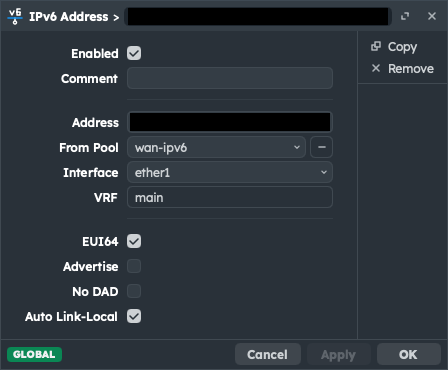

# cloudflare-ddns

> 🤖 Cloudflare Worker for mass-updating DNS records

> [!NOTE]
> This project is IPv6-only meaning you cannot mass update A records. Only *AAAA* records will work.

## Endpoints

Please visit the [OpenAPI reference documentation](https://axelrindle.github.io/cloudflare-ddns/).

## Router Setup

### MikroTik RouterOS

#### Update Script

Go to `System > Scripts` and create a new script with the following content:

<details>
<summary><code>cloudflare-dns-update</code></summary>

```
# the DHCPv6 client requests a prefix and creates a pool named "wan-ipv6" from it
# a public IPv6 address is automatically assigned to the WAN interface
# we retrieve the address assigned from the pool and strip the prefix length
:local ipv6 [ /ipv6/address/get [ find where from-pool="wan-ipv6" ] address ]
:local publicIpv6Address [ :pick $ipv6 0 [:find $ipv6 "/"] ]

:log info "Updating Cloudflare DNS records with AAAA $publicIpv6Address"

# build json payload for mass update
:local payload "{\
    \"ipv6\": \"$publicIpv6Address\",\
    \"zones\": [\
        {\
            \"token\": \"ZONE_1_API_TOKEN\",\
            \"zoneId\": \"ZONE_1_ID\",\
            \"records\": [\
                \"ZONE_1_RECORD_1_ID\",\
                \"ZONE_1_RECORD_2_ID\"\
            ]\
        },\
        {\
            \"token\": \"ZONE_2_API_TOKEN\",\
            \"zoneId\": \"ZONE_2_ID\",\
            \"records\": [\
                \"ZONE_2_RECORD_1_ID\",\
                \"ZONE_2_RECORD_2_ID\"\
            ]\
        }\
    ]\
}"

# do the mass update

:local workerUrl "https://REPLACE_WITH_WORKER_URL"
:local apiToken "super-secret-change-in-production"

/tool/fetch http-method=post \
  url="$workerUrl" \
  http-header-field="content-type:application/json,authorization:bearer $apiToken" \
  http-data="$payload" \
  keep-result=no
```

</details>

**Make sure to replace the placeholders with your actual tokens and record IDs**

No permissions are needed, you can safely untick all checkboxes.

#### DHCPv6 Client

Go to `IPv6 > DHCPv6 Client` and configure the client with the following script in the `Advanced` tab:

```
# the "pd-valid" variable specifies "if prefix is acquired and it is applied or not"
# see https://help.mikrotik.com/docs/spaces/ROS/pages/24805500/DHCP#DHCP-Script
:if ( $"pd-valid" = "1" ) do={
  # delay by one second to allow
  # for the new ipv6 to be applied
  :delay 1000ms

  /system/script/run cloudflare-dns-update
}
```

#### IPv6 Address

Go to `IPv6 > Addresses` and create a new assignment:



Make sure to tick the `EUI64` checkbox. This will automatically
assign the interface id for the last 64 address bits.

## License

[MIT](LICENSE)
